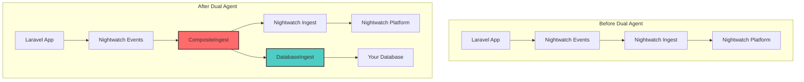
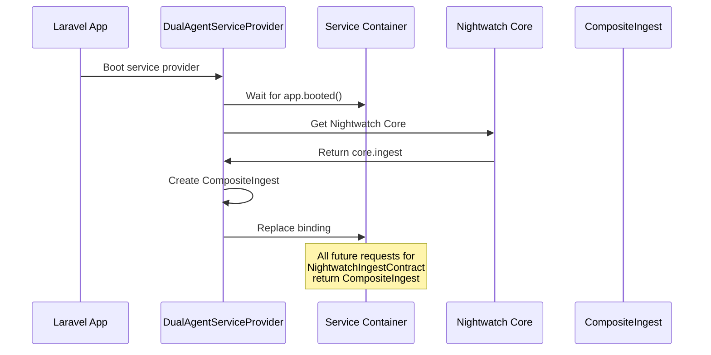
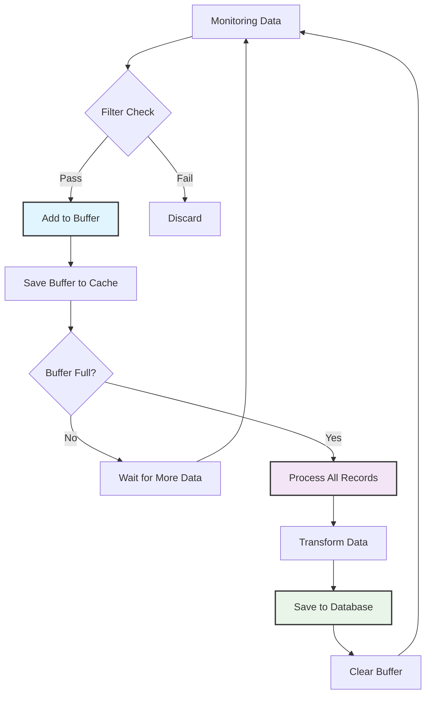
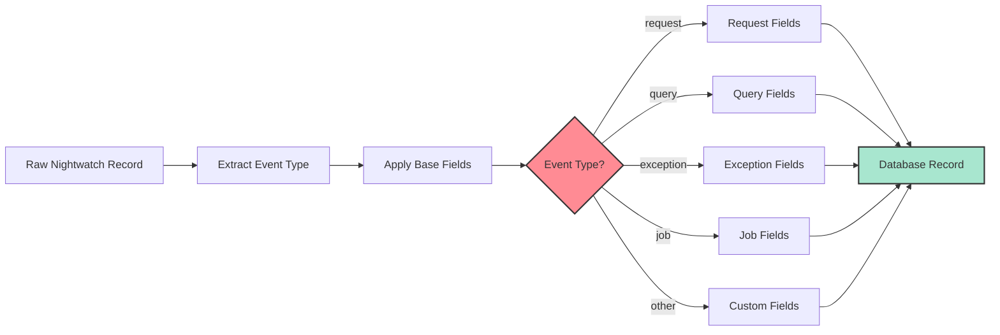
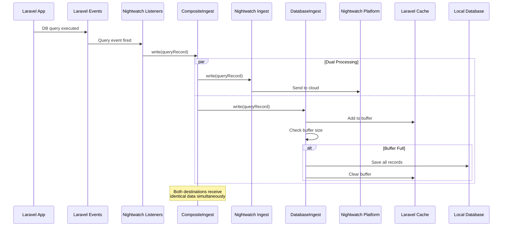
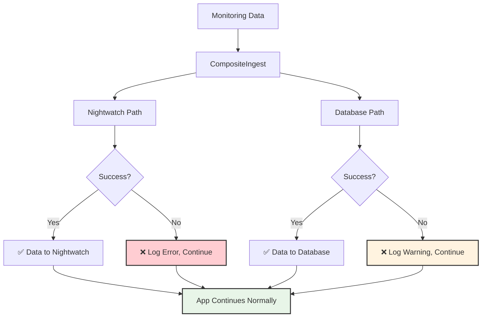
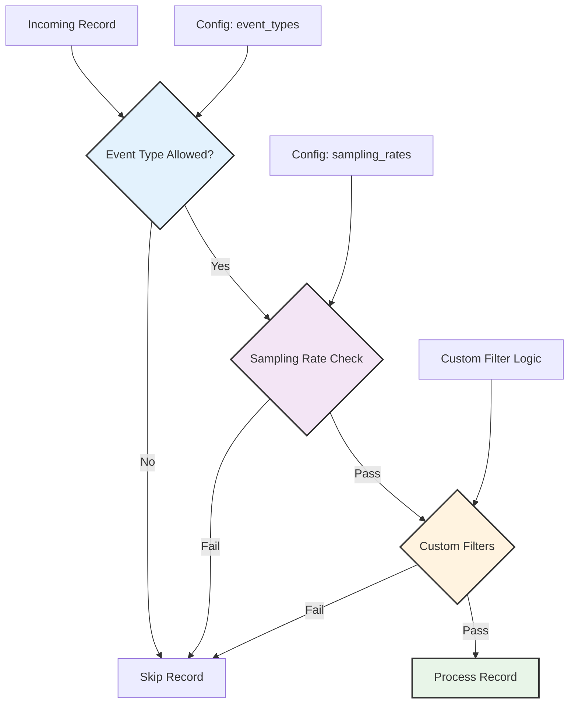
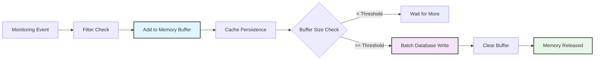

# How Dual Agent Intercepts Laravel Nightwatch Data

## Overview

This document explains the technical implementation of how the Dual Agent package intercepts and duplicates Laravel Nightwatch monitoring data to your local database without modifying Nightwatch's core functionality.

## The Core Concept: Service Container Binding Replacement

Dual Agent uses Laravel's service container to perform a "transparent proxy" pattern. It replaces Nightwatch's data ingestion service with a composite service that writes to both Nightwatch and your database.



## Step-by-Step Interception Process

### 1. Service Provider Registration

**File:** `src/DualAgentServiceProvider.php`

```php
protected function registerCompositeIngest(): void
{
    // Wait for all providers to boot
    $this->app->booted(function ($app) {
        // Safety checks and interception logic
    });
}
```

**What happens:**
- Dual Agent waits until Laravel has completely finished booting
- This ensures Nightwatch has already registered its services

### 2. Safety Validation

```php
// Check if dual agent is enabled
if (!$app['config']['dual-agent.enabled'] ?? false) {
    return;
}

// Check if Nightwatch is properly configured
if (!$this->isNightwatchProperlyConfigured($app)) {
    return;
}

// Check if Nightwatch Core is bound in the container
if (!$app->bound(\Laravel\Nightwatch\Core::class)) {
    return;
}
```

**What happens:**
- Validates that Dual Agent is enabled in configuration
- Ensures Nightwatch is properly installed and configured
- Confirms Nightwatch's core service is available

### 3. The Interception ("Service Theft")

```php
// Extract Nightwatch's original ingest service
$core = $app->make(\Laravel\Nightwatch\Core::class);
$nightwatchIngest = $core->ingest;

// Get our database ingest service
$databaseIngest = $app->make(CustomIngestContract::class);

// Create composite ingest that wraps both
$compositeIngest = new CompositeIngest($nightwatchIngest, $databaseIngest);

// Replace Nightwatch's binding with our composite
$app->instance(NightwatchIngestContract::class, $compositeIngest);
```

**What happens:**
1. **Extraction:** Gets Nightwatch's original data ingestion service
2. **Wrapping:** Creates a composite service that contains both Nightwatch's service and our database service
3. **Replacement:** Replaces Nightwatch's service binding in Laravel's container



## Data Flow Architecture

### The CompositeIngest Pattern

**File:** `src/Ingest/CompositeIngest.php`

```php
class CompositeIngest implements NightwatchIngestContract
{
    public function __construct(
        protected NightwatchIngestContract $nightwatchIngest,
        protected CustomIngestContract $databaseIngest
    ) {}

    public function write(array $record): void
    {
        // Always write to Nightwatch first (primary)
        try {
            $this->nightwatchIngest->write($record);
        } catch (\Exception $e) {
            Log::error('Nightwatch write failed', ['error' => $e->getMessage()]);
        }

        // Then write to database (secondary)
        if ($this->databaseIngest->isEnabled()) {
            try {
                $this->databaseIngest->write($record);
            } catch (\Exception $e) {
                Log::warning('Database write failed', ['error' => $e->getMessage()]);
            }
        }
    }
}
```

### Data Processing Flow

```mermaid
graph LR
    A[Laravel Event] --> B[Nightwatch Sensor]
    B --> C[CompositeIngest.write()]
    
    C --> D[Nightwatch Ingest]
    C --> E[Database Ingest]
    
    D --> F[Nightwatch Platform]
    E --> G[Buffer Management]
    G --> H[Data Transformation]
    H --> I[Database Storage]
    
    style C fill:#ff6b6b,stroke:#333,stroke-width:2px
    style G fill:#ffd93d,stroke:#333,stroke-width:2px
    style H fill:#4ecdc4,stroke:#333,stroke-width:2px
```

## Database Ingest Implementation

### Buffering Strategy

**File:** `src/Ingest/DatabaseIngest.php`

```php
public function write(array $record): void
{
    if (!$this->enabled || !$this->transformer->shouldSendRecord($record)) {
        return;
    }

    // Add to buffer
    $this->buffer[] = $record;
    
    // Persist buffer to cache for cross-request persistence
    cache()->put($this->cacheKey, $this->buffer, 3600);
    
    // Flush buffer when full
    if (count($this->buffer) >= $this->bufferSize) {
        $this->digest();
    }
}
```

### Buffer Management Flow



## Data Transformation Process

### Record Transformation

```php
protected function transformRecordToMetric(array $record): ?array
{
    $eventType = $record['t'] ?? 'unknown';
    
    // Base metric data
    $metricData = [
        'event_type' => $eventType,
        'event_timestamp' => date('Y-m-d H:i:s', (int) ($record['timestamp'] ?? microtime(true))),
        'trace_id' => $record['trace'] ?? $record['trace_id'] ?? null,
        'session_id' => session()->getId(),
        'user_id' => Auth::id(),
        'raw_payload' => $record,
    ];

    // Event-specific transformations
    switch ($eventType) {
        case 'request':
            $metricData = array_merge($metricData, [
                'method' => $record['method'] ?? null,
                'url' => $record['url'] ?? null,
                'status_code' => $record['status_code'] ?? null,
                'duration' => $record['duration'] ?? null,
                // ... more request fields
            ]);
            break;
            
        case 'query':
            $metricData = array_merge($metricData, [
                'sql' => $record['sql'] ?? null,
                'connection' => $record['connection'] ?? null,
                'query_duration' => $record['duration'] ?? null,
                // ... more query fields
            ]);
            break;
            
        // ... other event types
    }

    return $metricData;
}
```

### Transformation Flow



## Complete Data Flow Example

When a user makes a database query in your Laravel app:

```php
User::where('email', 'john@example.com')->first();
```

### The Complete Journey



## Error Handling and Resilience

### Graceful Degradation

```php
// In CompositeIngest::write()
try {
    $this->nightwatchIngest->write($record);
    Log::debug('✅ Nightwatch write successful');
} catch (\Exception $e) {
    Log::error('❌ Nightwatch write failed', [
        'error' => $e->getMessage(),
        'record_type' => $record['t'] ?? 'unknown',
    ]);
    // Continue execution - don't break the app
}

try {
    $this->databaseIngest->write($record);
    Log::debug('✅ Database write successful');
} catch (\Exception $e) {
    Log::warning('❌ Database write failed', [
        'error' => $e->getMessage(),
        'record_type' => $record['t'] ?? 'unknown',
    ]);
    // Continue execution - Nightwatch still works
}
```

### Error Isolation Strategy



## Configuration and Filtering

### Event Filtering System

```php
// In config/dual-agent.php
'filters' => [
    'event_types' => [
        'request', 'query', 'exception', 'job', 'log', 'cache'
    ],
    'sampling_rates' => [
        'request' => 1.0,    // 100% of requests
        'query' => 0.1,      // 10% of queries
        'exception' => 1.0,  // 100% of exceptions
        'log' => 0.01,       // 1% of logs
    ],
]
```

### Multi-Layer Filtering Flow



## Performance Considerations

### Buffer Management Strategy

| Buffer Size | Use Case | Pros | Cons |
|-------------|----------|------|------|
| 1-10 | Low traffic, immediate writes | Real-time data | High I/O overhead |
| 50-200 | Medium traffic, balanced | Good performance | Some memory usage |
| 500+ | High traffic, batch processing | Low I/O overhead | Higher memory usage |

### Memory and Performance Flow



## Summary

The Dual Agent package achieves transparent data interception through:

1. **Service Container Manipulation** - Replaces Nightwatch's ingest service with a composite wrapper
2. **Transparent Proxy Pattern** - CompositeIngest implements the same interface as Nightwatch's ingest
3. **Dual Data Paths** - Simultaneously writes to both Nightwatch and local database
4. **Buffered Processing** - Optimizes database writes through intelligent buffering
5. **Error Isolation** - Ensures failures in one path don't affect the other
6. **Configurable Filtering** - Allows fine-tuned control over what data is stored locally

This approach ensures:
- ✅ **Zero Code Changes** - Your app and Nightwatch work unchanged
- ✅ **Full Compatibility** - Nightwatch functionality is preserved
- ✅ **Performance Optimized** - Intelligent buffering and filtering
- ✅ **Error Resilient** - Graceful handling of failures
- ✅ **Configurable** - Extensive customization options

The result is a seamless dual-monitoring system that gives you both cloud-based Nightwatch analytics and local data storage for custom analysis.