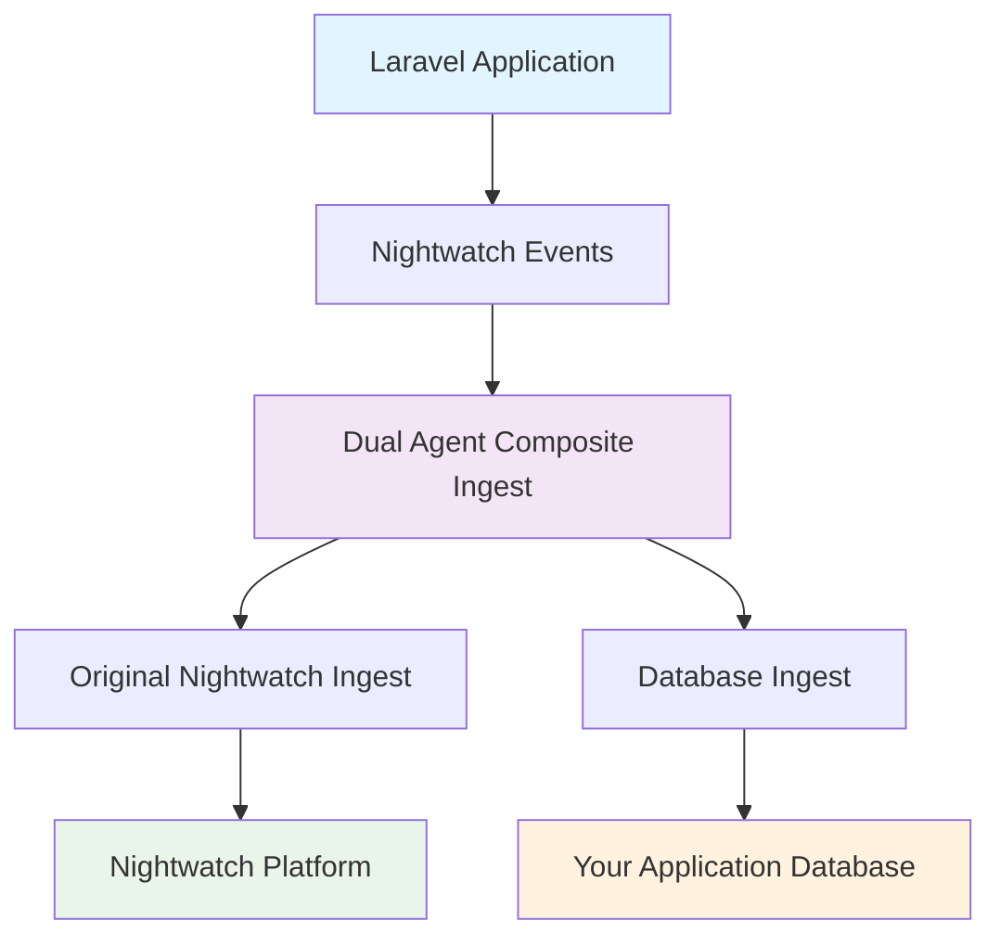

# Dual Agent for Laravel Nightwatch

<div align="center">

[](https://packagist.org/packages/theihasan/dual-agent)
[](https://github.com/theihasan/dual-agent/actions?query=workflow%3Arun-tests+branch%3Amain)
[](https://packagist.org/packages/theihasan/dual-agent)
[](https://packagist.org/packages/theihasan/dual-agent)

</div>

**Dual Agent** is a Laravel package that enables dual-monitoring alongside [Laravel Nightwatch](https://nightwatch.laravel.com). It automatically saves all Nightwatch monitoring data to your application's database while maintaining full compatibility with the original Nightwatch service.

## ✨ Features

- 🔄 **Dual Monitoring**: Automatically saves data to both Nightwatch service and your local database
- ⚡ **Zero Configuration**: Works out of the box with Laravel Nightwatch
- 🎯 **Auto-Discovery**: Automatically detects and integrates with existing Nightwatch setup
- 🛡️ **Graceful Error Handling**: Continues working even if database operations fail
- 📊 **Rich Database Schema**: Comprehensive metrics storage with proper indexing
- 💾 **Local Analytics**: Query and analyze your monitoring data locally
- 🔧 **Management Commands**: Status checking and installation tools
- 🚀 **Production Ready**: Built with performance and reliability in mind

## 📋 Requirements

- PHP 8.2+
- Laravel 10.0+
- [Laravel Nightwatch](https://nightwatch.laravel.com) installed and configured with sampling rates set appropriately

## 🚀 Quick Installation

### 1. Install the Package

```bash
composer require theihasan/dual-agent
```

### 2. Configure Nightwatch Sampling (Important!)

For the package to work correctly, ensure Nightwatch is configured to capture data. Add to your `.env`:

```env
# Nightwatch Configuration
NIGHTWATCH_ENABLED=true
NIGHTWATCH_TOKEN=your-nightwatch-token
NIGHTWATCH_REQUEST_SAMPLE_RATE=1.0
NIGHTWATCH_COMMAND_SAMPLE_RATE=1.0
NIGHTWATCH_EXCEPTION_SAMPLE_RATE=1.0

# Dual Agent Configuration  
DUAL_AGENT_ENABLED=true
DUAL_AGENT_AUTO_CONFIGURE=true
DUAL_AGENT_BUFFER_SIZE=1
DUAL_AGENT_REQUEST_SAMPLE_RATE=1.0
DUAL_AGENT_QUERY_SAMPLE_RATE=1.0
DUAL_AGENT_LOG_SAMPLE_RATE=1.0
```

### 3. Run the Installer

```bash
php artisan dual-agent:install
```

### 4. Check Status

```bash
php artisan dual-agent:status
```

## 🎉 That's it!

Your Laravel application now:
- 📊 **Sends monitoring data to Nightwatch** (original functionality)  
- 🗄️ **Stores all metrics in your local database** (additional functionality)

## 📖 How It Works

The Dual Agent package intercepts the Laravel Nightwatch ingest system and creates a composite ingest that saves data to both destinations:



The package automatically:
1. **Detects** your existing Nightwatch configuration
2. **Wraps** the original Nightwatch ingest with a composite ingest
3. **Sends** data to both Nightwatch platform and your database
4. **Handles** errors gracefully if either destination fails
5. **Maintains** full compatibility with your existing setup

## ⚙️ Configuration

The package automatically publishes its configuration to `config/dual-agent.php`. Here are the key options:

### Basic Configuration

```php
return [
    // Enable/disable the database storage
    'enabled' => env('DUAL_AGENT_ENABLED', true),
    
    // Buffer size for batch inserts
    'buffer_size' => env('DUAL_AGENT_BUFFER_SIZE', 100),
    
    // Auto-configure when Nightwatch detected
    'auto_configure' => env('DUAL_AGENT_AUTO_CONFIGURE', true),
];
```

### Event Filtering

Control which events are stored in your database:

```php
'filters' => [
    'event_types' => [
        'request', 'query', 'exception', 'job', 'log', 'cache',
        'mail', 'notification', 'scheduled_task'
    ],
    'sampling_rates' => [
        'request' => env('DUAL_AGENT_REQUEST_SAMPLE_RATE', 1.0),    // 100% of requests
        'query' => env('DUAL_AGENT_QUERY_SAMPLE_RATE', 0.1),       // 10% of queries
        'exception' => env('DUAL_AGENT_EXCEPTION_SAMPLE_RATE', 1.0), // 100% of exceptions
        'job' => env('DUAL_AGENT_JOB_SAMPLE_RATE', 0.5),           // 50% of jobs
        'log' => env('DUAL_AGENT_LOG_SAMPLE_RATE', 0.01),          // 1% of logs
    ],
],
```

### Database Configuration

Configure database storage and cleanup:

```php
'database' => [
    'connection' => env('DUAL_AGENT_DB_CONNECTION', null), // Use default if null
    'cleanup' => [
        'enabled' => env('DUAL_AGENT_CLEANUP_ENABLED', true),
        'retention_days' => env('DUAL_AGENT_RETENTION_DAYS', 30),
        'batch_size' => env('DUAL_AGENT_CLEANUP_BATCH_SIZE', 1000),
    ],
],
```

## 🗄️ Database Schema

The package creates comprehensive tables to store all monitoring data:

### `dual_agent_metrics` Table
Stores individual monitoring events with fields for:
- **Request metrics**: method, URL, status code, duration, memory usage
- **Database metrics**: SQL queries, connection, query duration
- **Exception metrics**: class, message, file, line, stack trace  
- **Job metrics**: class, queue, status, attempts, duration
- **Cache metrics**: key, operation, store
- **Mail metrics**: class, recipients, subject
- **Log metrics**: level, message, context
- **Performance stages**: bootstrap, middleware, action, render timings

### `dual_agent_aggregated_metrics` Table  
Stores pre-computed statistics for dashboard performance:
- Hourly, daily, weekly aggregations
- Performance percentiles (P95, P99)
- Error rates and status code distributions
- Job success rates
- Top exceptions and trends

## 🔧 Management Commands

### Installation & Setup

```bash
# Install and configure the package
php artisan dual-agent:install

# Force reinstallation  
php artisan dual-agent:install --force

# Install without optimization
php artisan dual-agent:install --without-optimization
```

### Status & Monitoring

```bash
# Check current status
php artisan dual-agent:status

# Detailed status with configuration and metrics
php artisan dual-agent:status --detailed
```

## 📊 Querying Your Data

Use the Eloquent models to query your monitoring data:

```php
use Ihasan\DualAgent\Models\DualAgentMetric;
use Ihasan\DualAgent\Models\DualAgentAggregatedMetric;

// Get all requests from today
$todayRequests = DualAgentMetric::requests()->today()->get();

// Find slow requests (> 1 second)
$slowRequests = DualAgentMetric::slowRequests(1000)->get();

// Get error rate for today
$errorCount = DualAgentMetric::requests()->errors()->today()->count();
$totalRequests = DualAgentMetric::requests()->today()->count();
$errorRate = $errorCount / $totalRequests * 100;

// Get recent exceptions
$exceptions = DualAgentMetric::exceptions()
    ->latest('event_timestamp')
    ->limit(10)
    ->get();

// Query aggregated metrics
$dailyStats = DualAgentAggregatedMetric::daily()
    ->requests()
    ->whereDate('metric_date', today())
    ->first();

if ($dailyStats) {
    echo "Today's average response time: {$dailyStats->avg_duration}ms";
    echo "Error rate: {$dailyStats->getErrorRate()}%";
}
```

### Model Scopes and Methods

The `DualAgentMetric` model includes many helpful scopes:

```php
// Event type scopes
DualAgentMetric::requests()     // HTTP requests
DualAgentMetric::queries()      // Database queries  
DualAgentMetric::exceptions()   // Exceptions
DualAgentMetric::jobs()         // Queue jobs
DualAgentMetric::cache()        // Cache operations
DualAgentMetric::mail()         // Email events
DualAgentMetric::logs()         // Log entries

// Time-based scopes
DualAgentMetric::today()
DualAgentMetric::yesterday()  
DualAgentMetric::thisWeek()
DualAgentMetric::thisMonth()
DualAgentMetric::betweenDates($start, $end)

// Performance scopes
DualAgentMetric::slowRequests($threshold)  // Default 1000ms
DualAgentMetric::slowQueries($threshold)   // Default 100ms  
DualAgentMetric::errors()                  // 4xx and 5xx responses
DualAgentMetric::failedJobs()              // Failed queue jobs
```

## 🎛️ Environment Variables

| Variable | Default | Description |
|----------|---------|-------------|
| `DUAL_AGENT_ENABLED` | `true` | Enable/disable database storage |
| `DUAL_AGENT_AUTO_CONFIGURE` | `true` | Auto-configure when Nightwatch detected |
| `DUAL_AGENT_BUFFER_SIZE` | `100` | Records to buffer before database insert |
| `DUAL_AGENT_REQUEST_SAMPLE_RATE` | `1.0` | Sampling rate for requests (0.0-1.0) |
| `DUAL_AGENT_QUERY_SAMPLE_RATE` | `0.1` | Sampling rate for database queries |
| `DUAL_AGENT_EXCEPTION_SAMPLE_RATE` | `1.0` | Sampling rate for exceptions |
| `DUAL_AGENT_JOB_SAMPLE_RATE` | `0.5` | Sampling rate for queue jobs |
| `DUAL_AGENT_LOG_SAMPLE_RATE` | `0.01` | Sampling rate for log entries |
| `DUAL_AGENT_CLEANUP_ENABLED` | `true` | Enable automatic data cleanup |
| `DUAL_AGENT_RETENTION_DAYS` | `30` | Days to retain metrics data |
| `DUAL_AGENT_AGGREGATION_ENABLED` | `true` | Enable metric aggregation |

## 🎯 Manual Usage

While the package works automatically, you can also manually store data:

```php
use Ihasan\DualAgent\Facades\DualAgent;

// Store custom metric data
DualAgent::writeNow([
    't' => 'custom_event',
    'message' => 'Custom monitoring data',
    'timestamp' => microtime(true),
    'custom_metadata' => [
        'user_id' => auth()->id(),
        'action' => 'important_action',
    ],
]);

// Check buffer status
$bufferSize = DualAgent::getBufferSize();
$bufferCount = DualAgent::getBufferCount();

// Force flush buffered data to database
DualAgent::digest();
```

## 📈 Performance Considerations

### Database Optimization

- **Indexes**: All important columns are properly indexed
- **Batch Inserts**: Records are inserted in batches for efficiency
- **Buffer Management**: Configurable buffer size prevents memory issues
- **Data Cleanup**: Automatic cleanup of old records
- **Sampling**: Configurable sampling rates for high-volume events

### Recommended Settings

For high-traffic applications:

```env
# Reduce sampling for verbose events
DUAL_AGENT_QUERY_SAMPLE_RATE=0.01
DUAL_AGENT_LOG_SAMPLE_RATE=0.001

# Increase buffer size for better batch performance  
DUAL_AGENT_BUFFER_SIZE=500

# Shorter retention period
DUAL_AGENT_RETENTION_DAYS=7
```

## 🛠️ Data Cleanup

The package includes automatic cleanup functionality:

```bash
# Manual cleanup (you can add this to your scheduler)
php artisan dual-agent:cleanup

# Or configure automatic cleanup in config/dual-agent.php
'database' => [
    'cleanup' => [
        'enabled' => true,
        'retention_days' => 30,
        'batch_size' => 1000,
    ],
],
```

Add to your `app/Console/Kernel.php` for automatic cleanup:

```php
protected function schedule(Schedule $schedule)
{
    $schedule->command('dual-agent:cleanup')->daily();
}
```

## 🚨 Error Handling

The package handles errors gracefully:

- **Database failures**: Logged but don't affect Nightwatch functionality
- **Migration issues**: Clear error messages for troubleshooting  
- **Configuration problems**: Detailed status checking
- **Performance issues**: Buffer management prevents memory problems

## 🔍 Troubleshooting

### Common Issues

#### Installation Fails
```bash
# Ensure Nightwatch is installed first
composer require laravel/nightwatch

# Then install dual agent
composer require theihasan/dual-agent

# Run migrations
php artisan migrate
```

#### Data Not Appearing

The most common issue is Nightwatch sampling rates being too low. Check your configuration:

```bash
# Check package status
php artisan dual-agent:status --detailed

# Verify Nightwatch sampling rates in .env
NIGHTWATCH_REQUEST_SAMPLE_RATE=1.0  # Must be 1.0 for testing
NIGHTWATCH_COMMAND_SAMPLE_RATE=1.0
NIGHTWATCH_EXCEPTION_SAMPLE_RATE=1.0

# Check if data is being intercepted
tail -f storage/logs/laravel.log | grep "CompositeIngest::write"

# Clear cache after configuration changes
php artisan cache:clear
```

#### Infinite Logging Loop

If you see "A possible infinite logging loop was detected" warnings:

```bash
# This is handled automatically by filtering DualAgent logs
# No action needed - the package prevents this by design

# If you still see issues, reduce log sampling rate
DUAL_AGENT_LOG_SAMPLE_RATE=0.001
```

#### Performance Issues
```bash
# Reduce sampling rates for high-volume events
DUAL_AGENT_QUERY_SAMPLE_RATE=0.01
DUAL_AGENT_LOG_SAMPLE_RATE=0.001

# Increase buffer size for better batch performance
DUAL_AGENT_BUFFER_SIZE=500

# Enable cleanup to prevent database bloat
DUAL_AGENT_CLEANUP_ENABLED=true
```

### Debug Mode

Enable detailed logging:

```env
LOG_LEVEL=debug
```

Check logs for detailed information:

```bash
# Monitor DualAgent activity
tail -f storage/logs/laravel.log | grep -i "dual.*agent"

# Check if CompositeIngest is receiving data
tail -f storage/logs/laravel.log | grep "CompositeIngest::write"

# Monitor database write operations
tail -f storage/logs/laravel.log | grep "DatabaseIngest::write"
```

### Test Route

The package includes debug routes to test functionality:

```bash
# Test dual agent functionality
curl http://your-app.test/debug-dual-agent

# Check Nightwatch sampling configuration  
curl http://your-app.test/check-sampling

# Minimal test route
curl http://your-app.test/minimal-test
```

## 🏗️ Architecture

The package follows Laravel best practices:

- **Service Provider**: Auto-discovery and dependency injection
- **Contracts**: Type-safe interfaces for all major components
- **DTOs**: Structured data objects for metrics
- **Facades**: Convenient static access to functionality
- **Commands**: Rich CLI for management and troubleshooting
- **Models**: Eloquent models with helpful scopes and methods
- **Migrations**: Comprehensive database schema with proper indexing

## 💡 Use Cases

- **Performance Monitoring**: Track response times and identify bottlenecks
- **Error Tracking**: Monitor exception rates and patterns
- **User Analytics**: Analyze user behavior and session data
- **Database Optimization**: Identify slow queries and optimize performance
- **Job Monitoring**: Track queue performance and failure rates
- **Custom Dashboards**: Build your own analytics dashboards
- **Historical Analysis**: Long-term trend analysis and reporting
- **Alerting**: Set up custom alerts based on your data

## 🤝 Contributing

Contributions are welcome! Please see [CONTRIBUTING.md](CONTRIBUTING.md) for details.

## 🔄 Changelog

Please see [CHANGELOG.md](CHANGELOG.md) for recent changes.

## 🔐 Security

If you discover any security-related issues, please email theihasan@gmail.com instead of using the issue tracker.

## 📄 License

The MIT License (MIT). Please see [License File](LICENSE.md) for more information.

## 💡 Credits

- [Ihasan](https://github.com/theihasan)
- Built for [Laravel Nightwatch](https://nightwatch.laravel.com)
- Inspired by the Laravel community

---

<div align="center">

**Happy Monitoring! 🎉**

*Store your Nightwatch data locally and unlock powerful analytics*

</div>